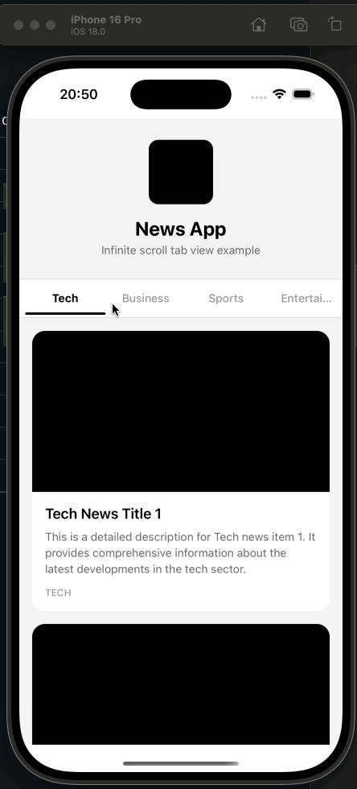

# react-native-infinite-tab-view

Infinite scroll tab view for React Native — built on **PagerView** + **Reanimated** for native-grade performance.

**New Architecture ready** | **Expo 55+ compatible** | **Drop-in replacement for react-native-collapsible-tab-view**

<p align="center">
  
  
</p>

## Architecture

```
┌─────────────────────────────────────────────────────┐
│  Tabs.Container                                     │
│                                                     │
│  ┌───────────────────────────────────────────────┐  │
│  │  Header (optional, collapsible)               │  │
│  └───────────────────────────────────────────────┘  │
│                                                     │
│  ┌───────────────────────────────────────────────┐  │
│  │  TabBar — ScrollView (smooth swipe)           │  │
│  │  ┌─────┬─────┬─────┬─────┬─────┐             │  │
│  │  │ Tab │ Tab │[Act]│ Tab │ Tab │  ← ∞ loop   │  │
│  │  └─────┴─────┴─────┴─────┴─────┘             │  │
│  │  ▓▓▓▓▓▓▓▓▓▓▓▓▓▓▓  ← Reanimated indicator    │  │
│  └───────────────────────────────────────────────┘  │
│                                                     │
│  ┌───────────────────────────────────────────────┐  │
│  │  PagerView (native gestures)                  │  │
│  │  ┌─────────┬─────────┬─────────┐             │  │
│  │  │  Page   │ [Visible│  Page   │             │  │
│  │  │ (lazy)  │  Page]  │ (lazy)  │             │  │
│  │  └─────────┴─────────┴─────────┘             │  │
│  │  offscreenPageLimit=1 → only 3 pages mounted  │  │
│  └───────────────────────────────────────────────┘  │
│                                                     │
└─────────────────────────────────────────────────────┘
```

## Why This Library?

### Rendering Efficiency — Only What You See

```
Traditional ScrollView approach (❌ wasteful):
┌───┬───┬───┬───┬───┬───┬───┬───┬───┬───┬───┬───┬───┬───┬───┐
│ 0 │ 1 │ 2 │ 3 │ 4 │ 5 │ 6 │ 7 │ 8 │ 9 │10 │11 │12 │13 │14 │
└───┴───┴───┴───┴───┴───┴───┴───┴───┴───┴───┴───┴───┴───┴───┘
  ▲   ▲   ▲   ▲   ▲   ▲   ▲   ▲   ▲   ▲   ▲   ▲   ▲   ▲   ▲
  ALL 15 pages mounted in DOM simultaneously
  Memory: O(N × VIRTUAL_MULTIPLIER)  →  45 pages for 5 tabs!


This library with PagerView (✅ efficient):
                    ┌───┬───┬───┐
                    │ 3 │[4]│ 5 │
                    └───┴───┴───┘
                      ▲   ▲   ▲
                      prev cur next
  Only 3 pages mounted at any time (offscreenPageLimit=1)
  Memory: O(3)  →  constant regardless of tab count!
```

### Infinite Loop — Clone & Jump Strategy

```
Page Layout (5 tabs):
┌──────────────────┬──────────────────┬──────────────────┐
│   Head Clones    │   Real Pages     │   Tail Clones    │
│  [0] [1] [2] [3] [4]│[0] [1] [2] [3] [4]│[0] [1] [2] [3] [4]│
└──────────────────┴──────────────────┴──────────────────┘
                    ↑ initialPage

Swipe left past clone[0]:             Swipe right past clone[4]:
  ┌──→ idle detected                    ┌──→ idle detected
  │    pendingJump = real[0]            │    pendingJump = real[4]
  │    setPageWithoutAnimation()        │    setPageWithoutAnimation()
  └──→ seamless! user sees no jump     └──→ seamless! user sees no jump

  No setTimeout ✓  No flicker ✓  Native-speed ✓
```

### Thread Architecture

```
┌─────────────────────────┐    ┌─────────────────────────┐
│      UI Thread          │    │      JS Thread          │
│  (native, 60fps)        │    │  (React, callbacks)     │
│                         │    │                         │
│  PagerView gestures ◄───┼────┼── onPageSelected        │
│  Page transitions       │    │   onPageScrollState     │
│  Reanimated indicator ◄─┼────┼── withTiming(200ms)     │
│  ScrollView tab swipe   │    │   activeIndex setState  │
│                         │    │   scrollTabToCenter     │
└─────────────────────────┘    └─────────────────────────┘

  Content swiping    → UI thread (PagerView native)
  Tab bar swiping    → UI thread (ScrollView native)
  Indicator sliding  → UI thread (Reanimated worklet)
  Tab centering      → JS thread (scrollTo)

  Result: gesture tracking never drops below 60fps
```

### Tab Bar — Smooth Swipe with Virtual Loop

```
Tab Bar (ScrollView, ×3 virtual multiplier):
┌─────────────────────────────────────────────────────────────────┐
│  Set 1 (clone)     │  Set 2 (center)    │  Set 3 (clone)       │
│ [A][B][C][D][E]    │ [A][B][C][D][E]    │ [A][B][C][D][E]      │
└─────────────────────────────────────────────────────────────────┘
                      ↑ initial scroll position

  User swipes tab bar freely ← →
  Edge detected? → requestAnimationFrame → reset to center
  No setTimeout ✓  No jank ✓  Smooth momentum ✓

Tab indicator animation:
  ┌─────┬─────┬─────┬─────┬─────┐
  │  A  │  B  │ [C] │  D  │  E  │   activeIndex: 2
  └─────┴─────┴─────┴─────┴─────┘
              ▓▓▓▓▓                  ← Animated.View
                                       useSharedValue(x, width)
  Tab press C → D:                      withTiming(200ms)
  ┌─────┬─────┬─────┬─────┬─────┐
  │  A  │  B  │  C  │ [D] │  E  │
  └─────┴─────┴─────┴─────┴─────┘
                    ▓▓▓▓▓            ← slides smoothly
```

### Dynamic Tab Width

```
Fixed width (❌ old):
┌──────────┬──────────┬──────────┬──────────┬──────────┐
│  Tech    │ Business │   AI     │  Sports  │  Music   │
│  100px   │  100px   │  100px   │  100px   │  100px   │
└──────────┴──────────┴──────────┴──────────┴──────────┘
  Wastes space on short labels, truncates long ones

Dynamic width (✅ new):
┌──────┬──────────┬─────┬────────┬───────┐
│ Tech │ Business │ AI  │ Sports │ Music │
│ 56px │   88px   │40px │  72px  │ 64px  │
└──────┴──────────┴─────┴────────┴───────┘
  Each tab measured via onLayout → pixel-perfect centering
```

### Performance Comparison

```
                        This Library          ScrollView-based
                        ────────────          ────────────────
Page engine             PagerView (native)    ScrollView (JS)
Gesture tracking        UI thread             JS thread
Mounted pages           3 (constant)          N × multiplier
Tab indicator           Reanimated worklet    Conditional render
Edge reset              rAF + idle event      setTimeout(100ms)
Jump mechanism          setPageWithoutAnim    scrollTo + setTimeout
Tab item re-render      React.memo            Full re-render
Tab width               Dynamic (onLayout)    Fixed (100px)

                        ┌──────────────────────────────┐
Frame budget (16ms):    │                              │
                        │  ████░░░░░░░░░░░░  8ms  ✅  │  This library
                        │  ████████████████  16ms  ⚠️  │  ScrollView-based
                        │  ████████████████████ 22ms ❌│  (frame drop)
                        └──────────────────────────────┘
```

## Features

- **PagerView** — native page gestures, 60fps guaranteed
- **Infinite horizontal scroll** for tabs and content
- **Reanimated indicator** — smooth sliding animation on UI thread
- **Dynamic tab width** — auto-measured via `onLayout`
- **Lazy rendering** — `offscreenPageLimit={1}`, only 3 pages mounted
- **Zero setTimeout** — all timing via `requestAnimationFrame` + idle detection
- **Active tab center alignment** — auto-scrolls with shortest-path algorithm
- **Collapsible header** support
- **New Architecture** (Fabric) ready
- **Expo 55+** compatible
- **Drop-in replacement** for react-native-collapsible-tab-view
- **FlashList** compatible
- **TypeScript** first

## Installation

```bash
npm install react-native-infinite-tab-view
# or
yarn add react-native-infinite-tab-view
# or
pnpm add react-native-infinite-tab-view
```

### Peer Dependencies

```bash
npm install react-native-reanimated react-native-pager-view
```

| Package | Required | Purpose |
|---------|----------|---------|
| `react-native-reanimated` | Yes | Tab indicator animation (UI thread) |
| `react-native-pager-view` | Yes | Native page gestures & transitions |
| `@shopify/flash-list` | Optional | High-performance list in tab content |

Follow the setup guides:
- [react-native-reanimated](https://docs.swmansion.com/react-native-reanimated/docs/fundamentals/getting-started/)
- [react-native-pager-view](https://github.com/callstack/react-native-pager-view#getting-started)

## Usage

### Basic Example

```tsx
import { Tabs } from 'react-native-infinite-tab-view';

function App() {
  return (
    <Tabs.Container
      infiniteScroll={true}
      tabBarCenterActive={true}
      onTabChange={(event) => console.log(event.tabName)}
    >
      <Tabs.Tab name="tech" label="Tech">
        <Tabs.FlatList
          data={newsItems}
          renderItem={({ item }) => <NewsCard item={item} />}
        />
      </Tabs.Tab>
      <Tabs.Tab name="business" label="Business">
        <Tabs.FlatList
          data={businessItems}
          renderItem={({ item }) => <NewsCard item={item} />}
        />
      </Tabs.Tab>
      {/* ... more tabs */}
    </Tabs.Container>
  );
}
```

### With Collapsible Header

```tsx
const HEADER_HEIGHT = 200;

function App() {
  return (
    <Tabs.Container
      renderHeader={() => (
        <View style={{ height: HEADER_HEIGHT }}>
          <Image source={require('./banner.png')} />
        </View>
      )}
      headerHeight={HEADER_HEIGHT}
    >
      <Tabs.Tab name="home" label="Home">
        <Tabs.ScrollView>
          <YourContent />
        </Tabs.ScrollView>
      </Tabs.Tab>
    </Tabs.Container>
  );
}
```

### With FlashList

```tsx
<Tabs.Tab name="feed" label="Feed">
  <Tabs.FlashList
    data={items}
    renderItem={({ item }) => <FeedCard item={item} />}
    estimatedItemSize={120}
  />
</Tabs.Tab>
```

### Custom Tab Bar

```tsx
import { Tabs, MaterialTabBar } from 'react-native-infinite-tab-view';

// Use built-in MaterialTabBar with customization
<Tabs.Container
  renderTabBar={(props) => (
    <MaterialTabBar
      {...props}
      activeColor="#F3BE21"
      inactiveColor="#86888A"
      indicatorStyle={{ height: 2 }}
    />
  )}
>
  {/* tabs */}
</Tabs.Container>

// Or build your own
function CustomTabBar({ tabs, activeIndex, onTabPress }: TabBarProps) {
  return (
    <View style={{ flexDirection: 'row' }}>
      {tabs.map((tab, index) => (
        <TouchableOpacity
          key={tab.name}
          onPress={() => onTabPress(index)}
        >
          <Text style={{ color: activeIndex === index ? 'blue' : 'gray' }}>
            {tab.label}
          </Text>
        </TouchableOpacity>
      ))}
    </View>
  );
}
```

## API Reference

### Tabs.Container

| Prop | Type | Default | Description |
|------|------|---------|-------------|
| `children` | `ReactNode` | - | `Tabs.Tab` components |
| `renderHeader` | `() => ReactElement` | - | Header above tabs |
| `renderTabBar` | `(props: TabBarProps) => ReactElement` | - | Custom tab bar |
| `headerHeight` | `number` | `0` | Header height (px) |
| `infiniteScroll` | `boolean` | `true` | Enable infinite loop |
| `tabBarCenterActive` | `boolean` | `true` | Auto-center active tab |
| `onTabChange` | `(event: TabChangeEvent) => void` | - | Tab change callback |
| `initialTabName` | `string` | - | Initial active tab name |
| `pagerProps` | `Partial<PagerViewProps>` | - | Props forwarded to PagerView |
| `containerStyle` | `StyleProp<ViewStyle>` | - | Container style |
| `headerContainerStyle` | `StyleProp<ViewStyle>` | - | Header wrapper style |
| `tabBarContainerStyle` | `StyleProp<ViewStyle>` | - | Tab bar wrapper style |

### Tabs.Tab

| Prop | Type | Description |
|------|------|-------------|
| `name` | `string` | Unique tab identifier |
| `label` | `string` | Tab label text |
| `children` | `ReactNode` | Tab content |

### MaterialTabBar

| Prop | Type | Default | Description |
|------|------|---------|-------------|
| `activeColor` | `string` | `"#000"` | Active tab text & indicator color |
| `inactiveColor` | `string` | `"#666"` | Inactive tab text color |
| `scrollEnabled` | `boolean` | `true` | Enable horizontal scroll |
| `indicatorStyle` | `StyleProp<ViewStyle>` | - | Indicator style override |
| `labelStyle` | `StyleProp<TextStyle>` | - | Label style override |
| `tabStyle` | `StyleProp<ViewStyle>` | - | Tab item style override |

### TabChangeEvent

```tsx
interface TabChangeEvent {
  tabName: string;     // Active tab name
  index: number;       // Active tab index
  prevTabName: string; // Previous tab name
  prevIndex: number;   // Previous tab index
}
```

### Hooks

| Hook | Returns | Description |
|------|---------|-------------|
| `useCurrentTabScrollY()` | `SharedValue<number>` | Current tab's scroll Y position |
| `useActiveTabIndex()` | `number` | Currently active tab index |
| `useTabs()` | `Tab[]` | Array of tab info |
| `useTabsContext()` | `TabsContextValue` | Full context value |

## Migration from react-native-collapsible-tab-view

```diff
- import { Tabs } from 'react-native-collapsible-tab-view';
+ import { Tabs } from 'react-native-infinite-tab-view';
```

Add peer dependency:
```bash
npm install react-native-pager-view  # if not already installed
```

## Requirements

- Expo SDK 55+ (New Architecture only)
- React Native >= 0.83
- React >= 19.2
- react-native-reanimated >= 3.0
- react-native-pager-view >= 6.0

## Contributing

Contributions are welcome! Please read our [Contributing Guide](CONTRIBUTING.md) for details.

## License

MIT License - see the [LICENSE](LICENSE) file for details.

## Author

**johntips**

- GitHub: [@johntips](https://github.com/johntips)
